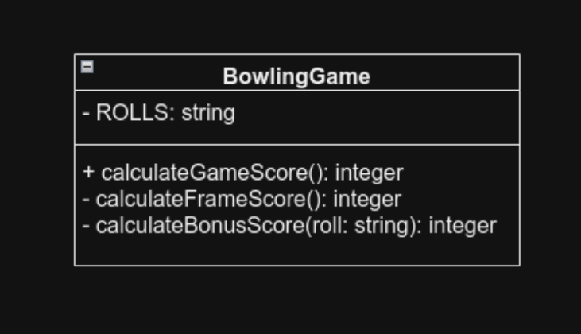

# Coding Kata

### <u>[Roman Numerals Kata](https://codingdojo.org/kata/RomanNumerals/)</u>

Create a method to converting numbers to numerals and a method to convert numerals to numbers. The Romans wrote numbers using letters, such as I, V, X, L, C, D, M.

 

#### Example Tests

| Test Case | Input | Expected Output  |
|-----------|-------|------------------|
| Test1     |       | throws Exception |
| Test2     | I     | 1                |
| Test3     | II    | 2                |
| Test4     | III   | 3                |
| Test5     | IV    | 4                |
| Test6     | V     | 5                |

 

#### Class Diagram

 

### <u>[Bowling Game Kata](https://codingdojo.org/kata/Bowling/)</u>

Create a program, which, given a valid sequence of rolls for one line of American Ten-Pin Bowling, produces the total score for the game.

 

#### Example Tests

| Test Case | Input                           | Expected Output |
|-----------|---------------------------------|-----------------|
| Test1     | X X X X X X X X X X X X         | 300             |
| Test2     | 9- 9- 9- 9- 9- 9- 9- 9- 9- 9-   | 90              |
| Test3     | 5/ 5/ 5/ 5/ 5/ 5/ 5/ 5/ 5/ 5/ 5 | 150             |

 

#### Class Diagram

